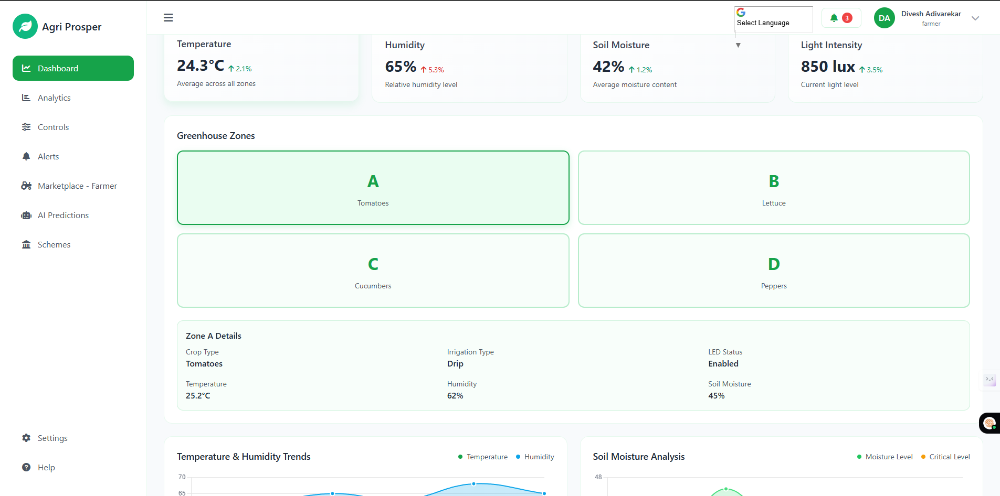

# Agri Prosper - Smart Greenhouse Management Made Simple
## [Dashbaord]([https://github.com/atharva-karanjawane](https://agriprosper-1kok.onrender.com/))
## Overview

**Agri Prosper** is an advanced Smart Greenhouse Management solution designed to help farmers optimize the growth of their crops through intelligent systems. This web application combines environmental control with plant disease detection, crop yield prediction, and advanced lighting management. With its intuitive interface and powerful backend, Agri Prosper is perfect for greenhouse owners who want to ensure the best conditions for their crops, improve productivity, and reduce manual intervention.

## Features

### 1. **User Authentication**

* **Registration and Login**: Users can sign up and log in to access personalized features.
* **Session Management**: Secure login with session-based authentication, ensuring the user's data is kept private.

### 2. **Dynamic Dashboard**

* **Overview Page**: A clean, modern UI showing all key greenhouse metrics at a glance, including temperature, humidity, and lighting conditions.
* **Visual Data Representation**: Real-time graphs and charts to monitor greenhouse conditions.

### 3. **Crop Yield Prediction**

* **Predict Yield**: Users can input greenhouse parameters (temperature, humidity, lighting conditions, etc.) and receive predictions about the total crop yield and yield per plant.
* **Stage-Specific Data**: The system accounts for different crop growth stages (germination, vegetative, flowering, and fruiting) and adjusts for each stage’s environmental needs.

### 4. **Plant Disease Detection**

* **Image-Based Detection**: Users can upload plant images, and the system will analyze them for signs of disease using advanced machine learning techniques.
* **Fast and Accurate**: The disease detection process is optimized for quick feedback and accuracy.

### 5. **Lighting Control System**

* **Advanced LED Control**: The system uses ESP32 to control the RGB LED light intensity (red, green, blue) for specific growth stages.
* **Energy-Efficient**: Only the necessary light colors are activated, ensuring optimal plant growth while minimizing energy usage.
* **ESP32 Integration**: The backend communicates with the ESP32 to send light intensity values (RGB) based on the plant's current growth stage.

### 6. **Maintenance Prediction**

* **Equipment Health**: The system predicts whether maintenance is needed for equipment based on usage and performance metrics.
* **Risk Level and Recommendations**: It provides maintenance risk levels and recommended dates for service.

### 7. **Smart Greenhouse Configuration**

* **Zone-Based Crop Configuration**: Users can configure specific crops per zone within the greenhouse, ensuring proper management and optimized growing conditions.
* **Temperature and Humidity Settings**: Environmental settings can be customized for different zones and growth stages, ensuring plants get the ideal conditions.

### 8. **Data Management and History Tracking**

* **Store Data**: All interactions, including crop yields, disease detection results, and maintenance logs, are saved in the database for easy retrieval.
* **History Tracking**: Users can view past predictions and disease detection results.
* **Reports**: The system generates downloadable PDF reports with detailed information about predictions and analysis.

### 9. **Schemes Page**

* **View Schemes**: Scheme data is dynamically loaded from a `schemes.json` file, providing users with relevant farming schemes.
* **Responsive Design**: The schemes page follows the same theme and design style as the rest of the dashboard, ensuring a cohesive user experience.

### 10. **Marketplace**
* **Buy and Sell Crops & Equipment**: A built-in marketplace where users can buy and sell agricultural products like seeds, fertilizers, tools, and crops.

* **Product Listings**: Detailed descriptions, prices, and images for each product.

* **Buyer & Seller Profiles**: Users can create profiles, manage product listings, and communicate directly with buyers or sellers.

* **Secure Transactions**: Enables secure payment processing and order tracking.

* **Ratings & Reviews**: Buyers can rate products and leave reviews to help others in the community.

* **Inventory Management**: Sellers can track their stock in real time and manage product availability.
## Technology Stack

* **Flask**: Python-based web framework for backend development.
* **SQLite**: Database for storing user data, crop predictions, and history tracking.
* **TailwindCSS**: Modern CSS framework used for the frontend UI design.
* **FastAPI**: Used for model inference (plant disease detection, yield prediction).
* **ESP32**: Used for the lighting control system to manage the RGB LED intensity.
* **OpenCV & TensorFlow**: For plant disease detection via image processing.
* **Pandas**: For data management and manipulation.

## Installation

To set up Agri Prosper locally, follow the instructions below.

### Prerequisites

* Python 3.8+
* Pip (Python package manager)

## Usage

After setting up Agri Prosper, you can interact with the application through the following key features:

1. **Sign up** to create a new account or **login** if you already have an account.
2. **View the Dashboard** for real-time data on greenhouse conditions.
3. Use the **Predict Yield** feature to get crop yield estimates based on the greenhouse conditions.
4. **Upload plant images** to detect diseases using the **Disease Detection** feature.
5. **Control the lighting system** by specifying parameters like LED intensity (RGB) for different growth stages.
6. Check equipment status and get **maintenance predictions**.
7. **View historical data** on crop predictions, disease detection, and equipment health.
8. Browse and load relevant farming **schemes**.

---

## Credits

**Team Members**:

- [Atharva Karanjawane](https://github.com/atharva-karanjawane)
- [Vedant Charegaonkar](https://github.com/vecvedant)

We would like to acknowledge the contributions of everyone involved in this project. The collective effort has made **Agri Prosper** possible and impactful in the agricultural technology space.

## License

This project is licensed under the MIT License - see the [LICENSE](LICENSE) file for details.

---

## Contributing

We welcome contributions! If you find any bugs or have suggestions for new features, feel free to open an issue or submit a pull request.

---

